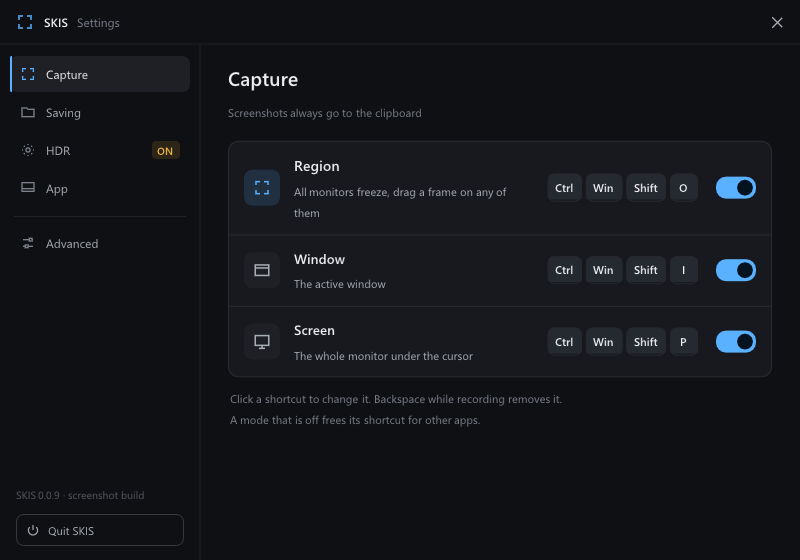

# SKIS — Special K Image Screenshot

A screenshot tool for Windows that gets HDR right.

Press a hotkey, select an area, and the screenshot is on the clipboard, looking the same as it does on screen, even when the monitor runs in HDR.



## Features

- **Region, window or whole screen**, each on its own global hotkey.
- **All monitors at once.** When selecting a region, every monitor freezes and dims together, and the frame can be drawn on any of them.
- **HDR screenshots that paste anywhere.** Captures of an HDR monitor are tone-mapped to SDR, so they look right in any app. They can also be kept as HDR PNG, or the choice can be made per screenshot.
- **Clipboard first.** Optionally also saves a PNG to a folder, named by a pattern such as `<app>_<date>_<time>`.
- **HDR on/off** for the monitor under the cursor, on a hotkey.
- **Stays out of the way** in the notification area, and can start with Windows.
- **English and Russian** interface, following the Windows display language.

## Default hotkeys

| Hotkey | Action |
| --- | --- |
| `Ctrl` + `Win` + `Shift` + `O` | Capture a region |
| `Ctrl` + `Win` + `Shift` + `I` | Capture the active window |
| `Ctrl` + `Win` + `Shift` + `P` | Capture the screen under the cursor |
| `Ctrl` + `Win` + `Shift` + `H` | Turn HDR on or off for the monitor under the cursor |

Every hotkey can be changed or turned off in the settings. While selecting a region, `Ctrl` + `S` toggles saving a file and `Esc` cancels.

## Building

Requirements: Visual Studio 2022 with the C++ desktop workload, the Windows 11 SDK and ATL.

```
msbuild SKIV.vcxproj -t:restore -p:RestorePackagesConfig=true
msbuild SKIV.vcxproj -p:Configuration=Release -p:Platform=x64 -p:PostBuildEventUseInBuild=false
```

The result is `Builds\SKIS.exe`. If MSBuild reports a missing MSVC toolset version, add `-p:VCToolsVersion=<installed version>`.

To have SKIS start with Windows, turn on **Start with Windows** in the settings.

## Credits

SKIS is based on [Special K Image Viewer](https://github.com/SpecialKO/SKIV) by Aemony and the Special K team.

Licensed under the MIT License, see [LICENSE](LICENSE). Third-party components are listed in [LICENSE-3RD-PARTY](LICENSE-3RD-PARTY).
